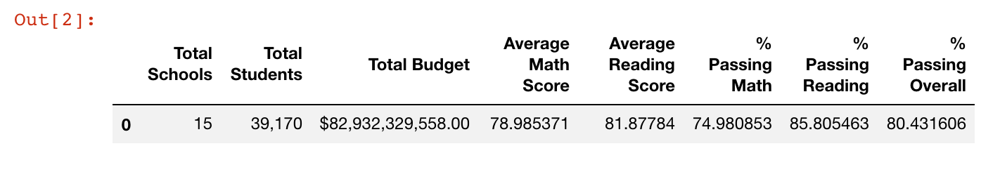
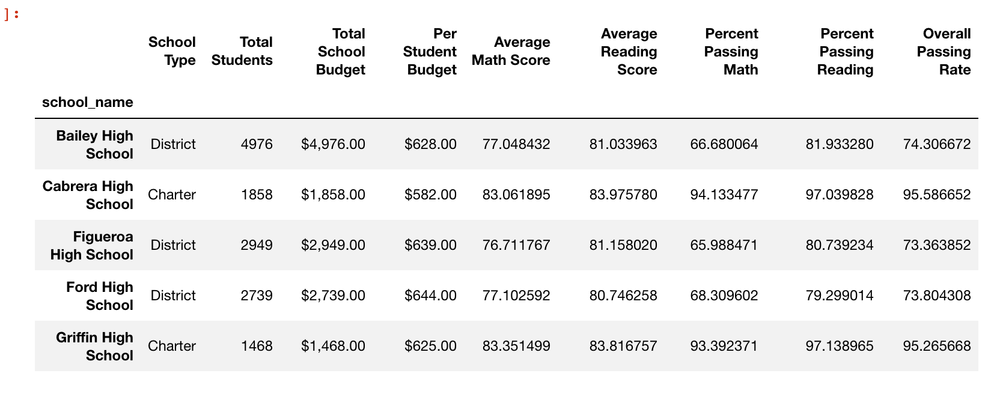
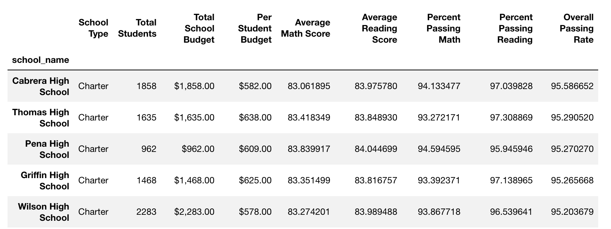
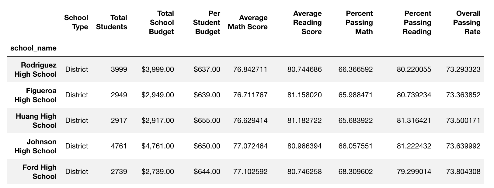
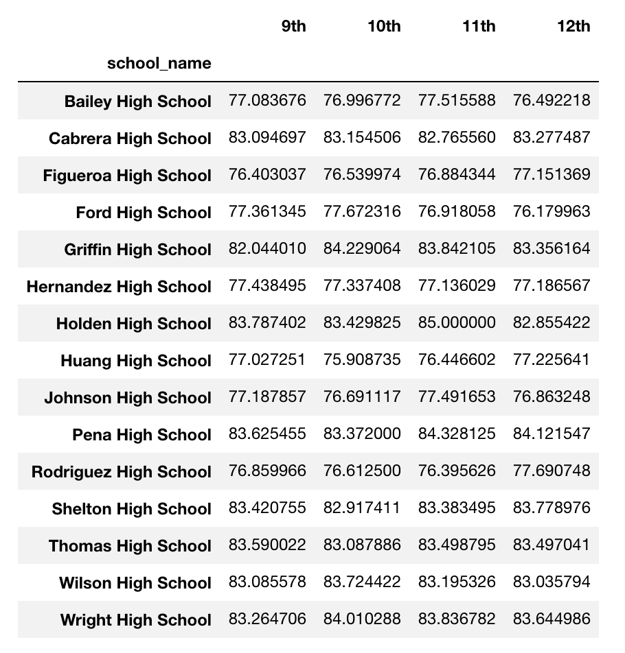
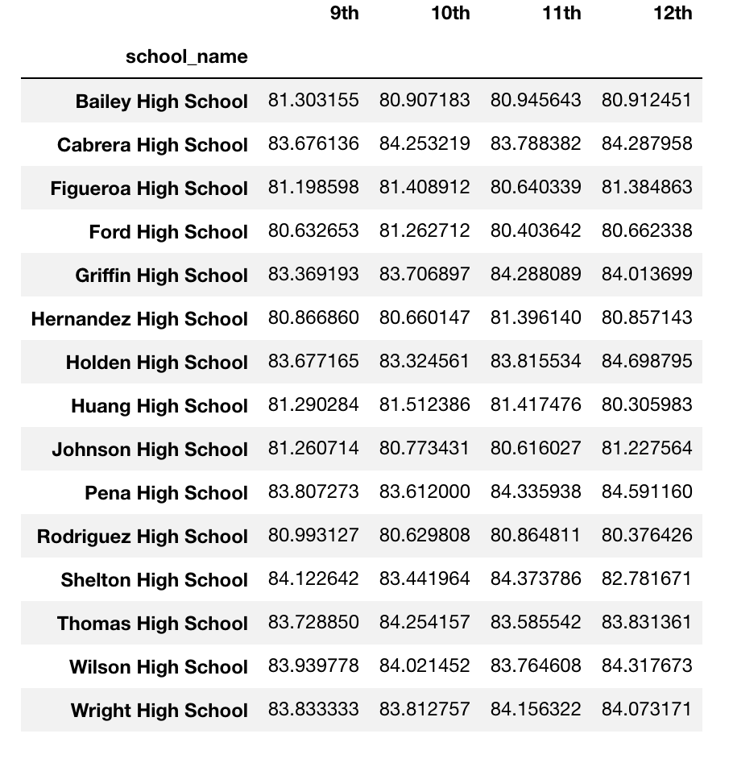
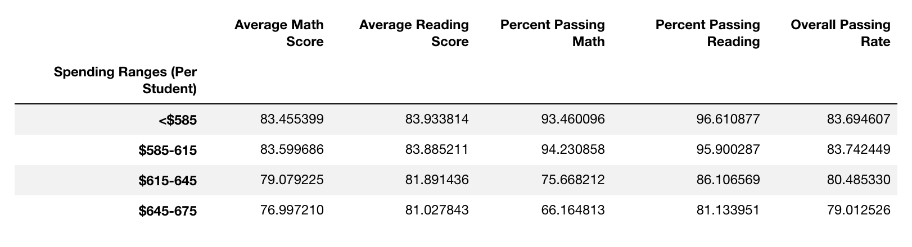
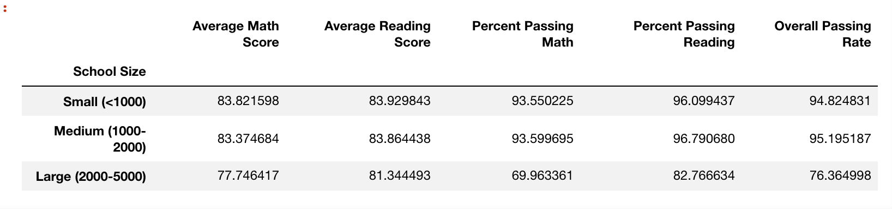
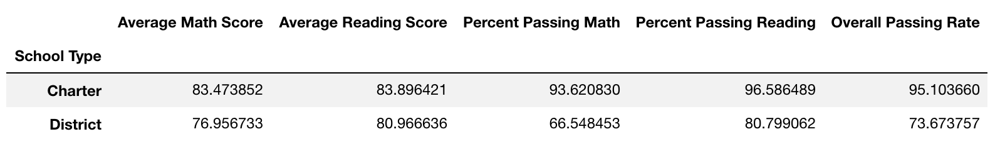

# Pandas_School_Data
Using the Pandas library to show trends in school performance

### District Summary

* A high level snapshot (in table form) of the district's key metrics. 

### School Summary

* An overview table that summarizes key metrics about each school.

### Top Performing Schools (By Passing Rate)

* The top 5 performing schools based on Overall Passing Rate. 

### Bottom Performing Schools (By Passing Rate)

* The bottom 5 performing schools based on Overall Passing Rate. Include all of the same metrics as above.

### Math Scores by Grade\*\*

* Table that lists the average Math Score for students of each grade level (9th, 10th, 11th, 12th) at each school.

### Reading Scores by Grade

* Table that lists the average Reading Score for students of each grade level (9th, 10th, 11th, 12th) at each school.

### Scores by School Spending

* Table that breaks down school performances based on average Spending Ranges (Per Student). School spending broken down into 4 bins to group.

### Scores by School Size

* Schools based on a 3 bins of school sizes (Small, Medium, Large).

### Scores by School Type

* Schools based on school type (Charter vs. District).

